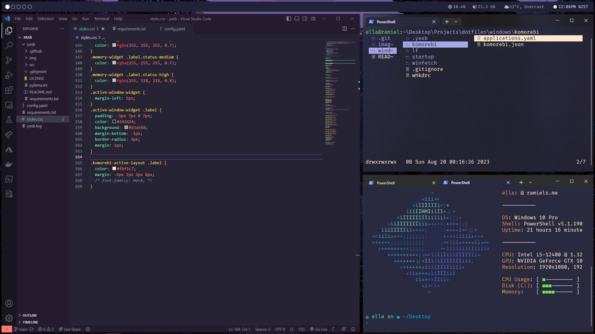

# dotfiles

### Windows:
- [yasb](https://github.com/denBot/yasb/) - status bar
- [lf](https://github.com/gokcehan/lf) - file manager
- [komorebi](https://github.com/LGUG2Z/komorebi) - window manager
- [whkdrc](https://github.com/LGUG2Z/whkd) - hotkey daemon
- [winfetch](https://github.com/lptstr/winfetch/) - system info
- startup - my startup scripts

### Mac:
- todo
